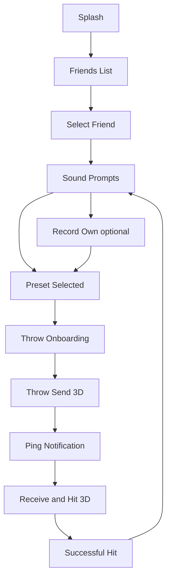
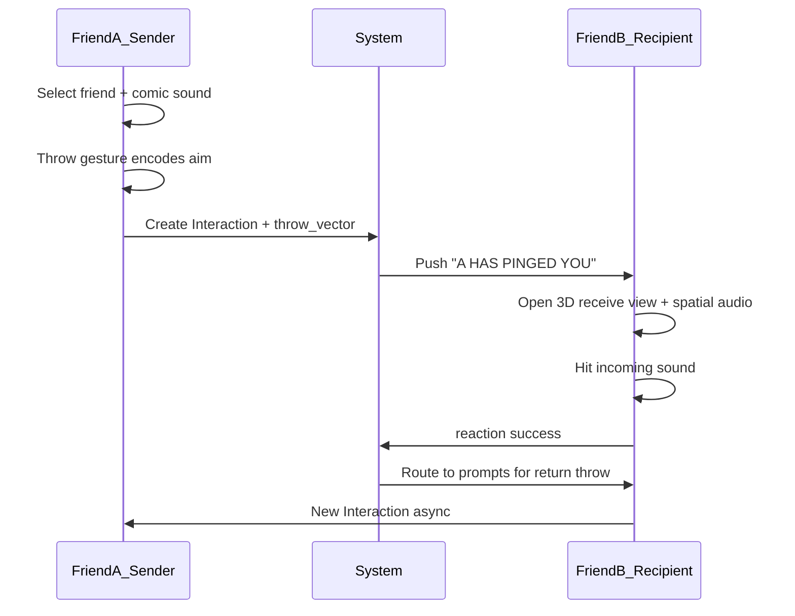
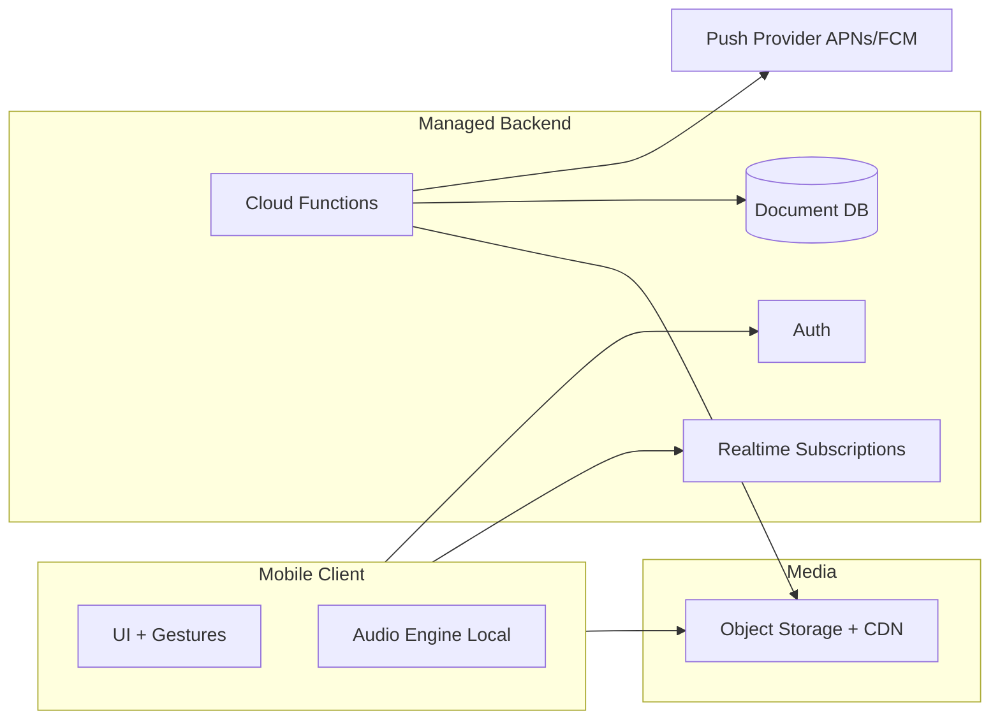
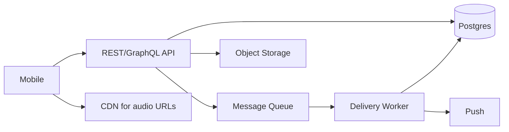
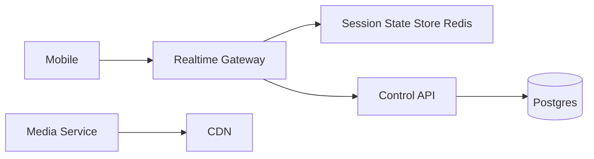
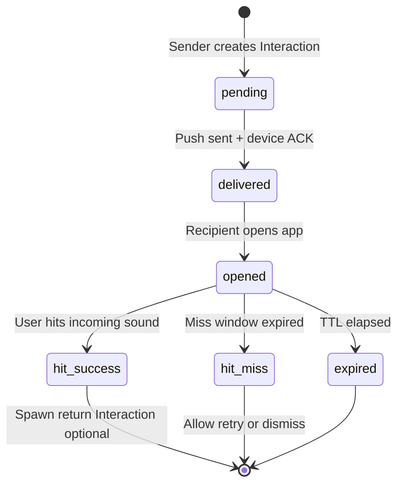

# Ponged: Northstar Plan (Frozen)

> **This document is the long-term product + systems northstar.** It is preserved as-is. For what to build now, see [ponged_v1_plan.md](ponged_v1_plan.md).

# Ponged: Production-Ready MVP System Plan

## Prerequisite: Bring repo local

**Current state:** [github.com/surajbarthy/ponged](https://github.com/surajbarthy/ponged) exists, `size: 0`, no files yet. `/Users/surajbarthy/ponged` exists locally but is empty.

**After plan approval (one-time setup):**

1. Install Xcode Command Line Tools if missing (`xcode-select --install`) — `git` is not available in the current environment.
2. Clone into the chosen path:
   ```bash
   git clone git@github.com:surajbarthy/ponged.git /Users/surajbarthy/ponged
   ```
3. Seed repo scaffolding (optional, post-plan): `README.md`, `docs/ARCHITECTURE.md` capturing this plan, `.gitignore` — only when you want versioned docs, not required for MVP build.

**Cursor workspace:** Use MCP `move_agent_to_root` to `/Users/surajbarthy/ponged` once cloned so agent work happens in the project root.

**Design reference:** 12-panel product storyboard (Friend A → Friend B ping loop). Store as `docs/storyboard.png` in repo when assets are added.

---

## 0. Canonical UX Flow (Storyboard)

The storyboard is the **source of truth for screen order and emotional beats**. Map each panel to a screen/state:

| # | Screen / state | User | System behavior |
|---|----------------|------|-----------------|
| 1 | **Splash** — `PONGED!` branding | A opens app | Session restore; preload preset audio |
| 2 | **Friends list** — avatars + names | A browses | Fetch accepted friendships; show pending pings badge |
| 3 | **Friend selected** — highlight row | A picks B | Set `recipient_id`; navigate to prompts |
| 4 | **Sound prompts** — comic bubbles (`POW!`, `ZAP!`, `BANG!`…) | A browses presets | Scrollable preset grid; each maps to bundled `SoundPayload` |
| 5 | **Prompts (scroll)** — more presets + **Record your own** | A discovers record | Mic permission gate; max 2–3s record |
| 6 | **Preset selected** — e.g. `CRASH!` highlighted | A commits sound | Lock `sound_payload_id`; navigate to throw onboarding |
| 7 | **Throw onboarding** — instructional overlay | A learns mechanic | Show once per install (or until dismissed); **safety copy**: simulate throw, do not literally throw device |
| 8 | **Throw send** — faux-3D wireframe; sound arc | A performs throw gesture | Capture `throw_vector` from IMU; animate arc; create `Interaction` |
| 9 | **Ping notification** — `{A} HAS PINGED YOU!` | B notified | Push + in-app; deep link to receive flow |
| 10 | **Receive / hit** — incoming arc in 3D view + spatial audio | B opens & plays | Pan audio by `aim`; user swipes/taps to “hit” incoming bubble |
| 11 | **Success** — `SUCCESSFUL HIT!` | B completes | Mark `reacted`; short celebration; auto-route to prompts (panel 12) |
| 12 | **Return prompts** — same grid as (4) | B sends back | Pre-select Friend A; loop continues asynchronously |



**Naming alignment:** Product copy uses **“ping”** (notification) and **“throw”** (send gesture). Backend entity remains `Interaction`; user-facing string: “A pinged you.”

---

## 1. Product Breakdown

### Core user loop (storyboard-aligned)



**Loop definition (one “pong”):**

1. **Select** — Friend list → pick one friend (panels 2–3).
2. **Arm** — Choose comic preset or short recording (panels 4–6).
3. **Throw** — Onboarding then embodied send: phone gesture propels sound through faux-3D space; encodes trajectory metadata (panels 7–8).
4. **Ping** — Recipient gets high-attention notification (panel 9).
5. **Receive & hit** — Spatial playback + interactive “hit” in receive view (panel 10).
6. **Celebrate & return** — Success screen → prompts to throw back (panels 11–12).

**Emotional contract:** Feels like **play** (comic sounds, throw, catch), not inbox management. Async — B can hit back minutes later.

### MVP feature set (minimum viable)

| Area | In MVP | Storyboard panel |
|------|--------|------------------|
| Identity | Sign-in, display name, avatar | — |
| Friends | Invite / mutual accept; friend list UI | 2–3 |
| Comic presets | 8–12 branded bubbles (`POW!`, `CRASH!`, …) | 4–6 |
| Record own | ≤2–3s; scroll to reveal | 5 |
| Throw onboarding | One-time instructional overlay + safe gesture copy | 7 |
| Throw send | IMU-based throw detection + faux-3D arc animation | 8 |
| Ping delivery | Push: `{name} HAS PINGED YOU!` + deep link | 9 |
| Receive view | Incoming arc + stereo pan by `aim` / `throw_vector` | 10 |
| Hit interaction | Tap/swipe to intercept; success/fail feedback | 10–11 |
| Return loop | Success → prompts with sender pre-selected | 11–12 |
| Safety | Block, report, rate limits; mutual friends only | — |
| Settings | Mute, quiet hours, reduce motion | — |

**MVP visual style:** Bold comic typography, yellow/pink/green full-screen beats (splash, notify, success) per storyboard — not a generic chat UI.

### Tiered fidelity (what “3D” means per phase)

| Phase | 3D / throw implementation |
|-------|---------------------------|
| **Phase 0** | 2.5D: fixed camera wireframe + parabolic arc; throw = shake or swipe-up fallback |
| **MVP** | Same faux-3D; real accelerometer peak detection; `throw_vector` stored; shared logic, not shared live session |
| **V2** | Richer trajectories; gyro aim tuning; optional second camera angle |
| **V3** | Shared spatial frame experiments, AR, wearables |

**Important:** Panels 8–10 do **not** require two devices in a live 3D session for MVP. Sender encodes aim/vector; receiver **replays** that trajectory locally.

### Explicitly OUT of scope for MVP

- Public feed, discovery, or stranger matching
- Group hits (3+ people)
- Live/real-time voice rooms or synchronized multiplayer 3D room
- True shared AR coordinate space between devices
- True binaural/HRTF spatial audio pipeline
- AR, wearables, watch apps
- Custom sound marketplace / UGC moderation at scale
- Rich chat, read receipts, typing indicators
- Android *and* iOS parity on day one (pick one platform for TestFlight MVP if resources are tight)
- End-to-end encryption of audio (TLS + access control is enough initially)
- Complex streaks/gamification economy

### Early kill risks

| Risk | Why it kills | Mitigation |
|------|----------------|------------|
| **No repeat loop** | One novelty send, never returns | Optimize for *return hit within 24h*; measure rally depth not installs |
| **Notification fatigue** | Feels like spam | Batch, smart throttle, “only close friends”, rich but rare pushes |
| **Awkward onboarding** | Empty friend graph | Invite deep link + “ping your person” onboarding, not explore |
| **Latency kills play** | Hit feels dead | Preload presets; small payloads; optimistic UI on send |
| **Throw gesture unreliable** | Send flow breaks; users feel silly | Fallback: swipe-up to throw; tune IMU thresholds; never require literal device throw |
| **Hit detection frustrating** | Success screen never comes | Generous hitbox; audio-led timing window (~1.5s); optional “easy mode” in beta |
| **“Throw your phone” liability** | Bad press / injury | Onboarding: **simulate** throwing motion while gripping phone; legal copy in FAQ |
| **Creepy / harassment** | Social apps die from trust | Mutual friends only, block-first UX, no search-by-phone in MVP |
| **Audio IP / moderation** | Custom recordings = abuse | MVP: presets primary; recordings private between friends + report |
| **Platform rejection** | Mic + motion + background audio | Permission rationale screens; TestFlight notes early |

---

## 2. System Architecture (3 approaches)

### Approach A — “Mobile + BaaS + object storage” (fastest learning)



| Layer | Options |
|-------|---------|
| Client | React Native/Expo, Flutter, or native Swift/Kotlin |
| Backend | Firebase, Supabase, or AWS Amplify |
| Realtime | Firestore/Supabase Realtime listeners on `interactions` |
| Media | Presets bundled in app; uploads to S3/R2/Supabase Storage |
| Events | Cloud function on `interaction.created` → push + delivery state |
| Notifications | FCM + APNs via BaaS |

**Tradeoffs:** Fastest to MVP; vendor coupling; realtime scaling can get expensive; logic in functions can sprawl without discipline.

---

### Approach B — “API-first + queue + worker” (balanced)



| Layer | Options |
|-------|---------|
| Client | Same as A |
| Backend | Node/Go/Python API (Fly.io, Railway, ECS) |
| Async | SQS, Redis streams, or BullMQ |
| Realtime | Optional: WebSocket for “hit landed” or poll + push only for MVP |
| Media | API issues signed upload URL; worker validates duration/size |
| Events | `InteractionCreated` → queue → push, analytics, abuse checks |

**Tradeoffs:** More control and clearer domain model; ~2–4 weeks slower than A; easier to migrate and test; team needs backend ownership.

---

### Approach C — “Realtime-first edge” (highest fidelity, slowest)



WebSocket/WebTransport for instant “hit incoming” and live rally feel; Postgres for durable history; dedicated media service for transcode (even simple loudness normalize).

**Tradeoffs:** Best embodied UX potential; connection management, battery, and ops complexity; overkill until loop retention is proven.

### Comparison matrix

| Criterion | A BaaS | B API+Queue | C Realtime edge |
|-----------|--------|-------------|-----------------|
| Speed to build | High | Medium | Low |
| Scalability to 100k DAU | Medium | High | High |
| Complexity | Low–Med | Med | High |
| Maintainability | Med (vendor) | High | Med–Low early |
| **Recommendation** | **Prototype + MVP if solo** | **Production path after validation** | **V2+ if realtime feel is core** |

**Pragmatic path:** Start A for prototype/MVP; extract domain to B before growth or fundraising diligence.

---

## 3. Core Data Model

### Entities

**User**
- `id`, `handle`, `display_name`, `avatar_url`, `created_at`, `settings` (quiet hours, haptics)

**Friendship**
- `user_id`, `friend_user_id`, `status` (pending | accepted | blocked), `created_at`
- Constraint: mutual acceptance before sends (MVP)

**SoundPayload**
- `id`, `type` (preset | recording), `preset_key` OR `storage_url`, `duration_ms`, `checksum`, `created_by`
- Presets: immutable, app-bundled; recordings: TTL optional (90d) for cost

**Interaction** (atomic “ping” / hit)
- `id`, `thread_id`, `sender_id`, `recipient_id`, `sound_payload_id`
- `throw_vector`: `{ pitch, yaw, roll_delta, peak_accel, duration_ms }` — from send gesture (panel 8)
- `aim`: derived from `throw_vector` → `{ azimuth_deg, elevation_deg, intensity_0_1 }` for recipient playback
- `trajectory_preset`: `arc_short | arc_high | arc_side` — client animation key, computed server-side or on send
- `delivery_state`: pending → delivered → opened → hit_success | hit_miss | expired
- `reaction` (nullable): `{ outcome: success | miss, hit_latency_ms, counter_sound_payload_id, throw_vector }`
- `parent_interaction_id` — links return hit to prior ping
- `created_at`, `opened_at`, `reacted_at`, `expires_at`

**Thread** (per friend pair)
- `id`, `participant_ids[]`, `last_interaction_at`, `active_streak_count` (defer gamification to V2)

**Device**
- `user_id`, `push_token`, `platform`, `app_version`

### Send → receive → respond flow



**Data flow:**

1. **Send:** Client validates friendship → creates `Interaction(pending)` + uploads audio if needed → server enqueues delivery job.
2. **Deliver:** Worker sends push with minimal payload (interaction_id, sender name, sound hint); client fetches full interaction on open.
3. **Play:** Client resolves `SoundPayload`, renders incoming arc from `trajectory_preset` + `aim`, plays spatial pan, marks `opened`.
4. **Hit:** Client runs hit detector (screen tap in bubble path or swipe intercept); on success → `hit_success` + panel 11 UX; posts `reaction`.
5. **Return:** Route to prompts (panel 12) with `recipient_id` = original sender; new `Interaction` on throw with `parent_interaction_id` set.
5. **Thread update:** Denormalize `last_interaction_at` on `Thread` for inbox sorting.

**Idempotency:** Client-generated `client_request_id` on send to prevent double-tap duplicates.

---

## 4. Interaction and Experience Layer

### Throw gesture (send — panel 8)

**Primary:** Detect throw via accelerometer/gyro peak pattern (forward impulse + rotation).

| Signal | Use |
|--------|-----|
| Peak linear acceleration | Validates intentional throw |
| Rotation delta | Maps to `azimuth_deg` / arc direction |
| Gesture duration | Distinguish throw vs walk |

**Fallbacks (required for MVP):**
- **Swipe-up** on wireframe view = throw (same metadata, lower delight)
- **Tap “Launch”** after failed IMU (accessibility / failed detection)

**Safety UX (panel 7):** Copy like storyboard (“throw the sound”) but subtext: *Grip your phone — mimic a throw, don’t release.* First-run only; skippable.

### Receive & hit (panel 10–11)

| Technique | MVP fit | Notes |
|-----------|---------|-------|
| **Faux-3D wireframe + parabolic arc** | Yes | Single SceneKit/RealityKit/Three.js-style view; not multiplayer-synced |
| **Stereo pan + volume** | Yes | Driven by `aim.azimuth_deg` as bubble approaches |
| **Haptic pulse** | Yes | On near-miss / successful hit |
| **Hit target** | Yes | 2D projection of 3D bubble; generous collider |
| **HRTF / head tracking** | V2–V3 | Defer |

**Hit detection options (pick one for MVP, others later):**
1. **Tap** when bubble enters hit zone (simplest)
2. **Swipe** toward bubble origin (storyboard “try to hit it”)
3. **Motion** — swing phone (V2; higher false positive rate)

**Success (panel 11):** Full-screen green + checkmark → 1.2s → auto-navigate to prompts with friend context preserved.

### Spatial / directional audio (simulated)

| Technique | MVP fit | Notes |
|-----------|---------|-------|
| **Pan follows arc position** | Yes | L/R gain updates as animation progresses |
| **Comic SFX presets** | Yes | Short, loud, recognizable; core brand |
| **UI spatial origin** | Yes | Bubble enters from edge matching `aim` |
| **HRTF pre-baked per preset** | V2 | Optional left/right asset variants |

### Input summary (storyboard-mapped)

| Input | Panel | Phase |
|-------|-------|-------|
| Friend select | 3 | MVP |
| Preset tap | 6 | MVP |
| Record | 5 | MVP |
| Throw gesture | 8 | MVP (+ fallbacks) |
| Hit tap/swipe | 10 | MVP |
| Return throw | 12 | MVP |

### Fallbacks (no fancy hardware)

- Swipe-up send instead of IMU throw
- Tap-to-hit instead of motion catch
- Flat 2D arc (no wireframe) if GPU perf poor on older devices
- Reduce motion: static bubble + pan only, skip arc animation
- Presets only if mic denied
- In-app banner if push denied

### Accessibility

- Visual waveform + direction arrow redundant to audio
- Haptics optional, never sole signal
- VoiceOver labels: “Hit from Alex, from your left”
- Reduce motion: disable screen-origin animations, keep pan
- Captions not applicable; offer silent mode with visual “pong” pulse

---

## 5. Incremental Build Plan

### Phase 0 — Prototype (1–2 weeks, fake backend)

**Build (all 12 panels, degraded fidelity):**
- Screens: splash → friends (hardcoded) → 4 comic presets → throw onboarding → faux-3D send → fake “ping” banner → receive/hit → success → return prompts
- Throw: swipe-up fallback only if IMU flaky
- Hit: large tap target
- No accounts; local state only

**Validate:**
- Do users **smile** at throw + hit?
- Do they understand they can ping back without explanation?
- Time-to-first-return-hit < 3 minutes in paired test

**Defer:** Real push, recordings, friend graph, backend.

---

### Phase 1 — MVP (6–10 weeks, storyboard-complete)

**Build:**
- Full panel flow with real auth, friends, push (`HAS PINGED YOU`), IMU throw + fallbacks, spatial receive, success → return loop
- 8–12 comic presets + record
- `throw_vector` + `aim` on every Interaction
- Backend Approach A or lean B
- Safety: block/report, mutual friends

**Validate:**
- D1 return hit rate (panel 12 usage)
- Hit success rate (panel 11 / opens) — target >70% (tune hitbox if lower)
- % pairs with ≥3 pings in 7 days

**Defer:** Android, true shared 3D, HRTF, groups, streaks, live socket.

---

### Phase 2 — V2 (enhanced interaction)

**Build:** Motion-based hit; richer comic pack; trajectory variants; gyro tuning; inbox/history view; migrate to Approach B; loudness normalize on recordings.

**Validate:** Session depth, W4 retention, throw fallback usage rate (if >30% use fallback, fix IMU).

**Defer:** AR, wearables, public discovery.

---

### Phase 3 — V3 (advanced)

**Build:** True spatial audio experiments, Apple Watch glance, Android parity, close-friend groups, optional live “rally mode”.

**Validate:** Platform-specific engagement; cost per MAU.

---

## 6. Critical Unknowns and fast tests

| Unknown | Type | Fast test |
|---------|------|-----------|
| Will users send a *second* hit unprompted? | Behavioral | Phase 0 paired test; measure panel-12 return without prompt |
| Is throw gesture delightful or awkward? | UX | IMU vs swipe-up A/B; interview after first send |
| Can users hit reliably? | UX | Log hit_miss rate; tune collider until success >70% |
| Is directional audio noticeable or gimmick? | UX | A/B: pan+arc vs flat audio in receive view |
| Presets vs custom recordings usage | Product | Log ratio week 1; cap recordings if <20% usage |
| Optimal notification copy/frequency | UX | 3 push variants, 50 users each |
| Invite conversion | Growth | Single deep link; track invite → install → first send funnel |
| Abuse on custom audio | Technical/trust | Internal dogfood + report button; manual review first 500 users |
| Cold-start friend graph | UX | Onboarding that forces “pick one person” before home screen |
| Backend cost per 1k hits | Technical | Load test 30s audio, 10k interactions on staging |
| iOS background audio rules | Technical | TestFlight review notes + permission flows early |

---

## 7. MVP Success Criteria

### Engagement signals

- **Activation:** User sends first hit within 24h of install
- **Rally rate:** ≥40% of activated users receive or send a return hit within 48h (adjust after baseline)
- **Depth:** Median 4+ interactions per active friend thread in first 14 days
- **Latency:** p95 open-to-playback < 500ms on WiFi/LTE

### Retention signals

- **D7 retention** among users with ≥1 mutual friend and ≥2 interactions: target ≥25% (benchmark against playful social, not messaging giants)
- **W4 retention** for “activated rally” cohort: ≥15%
- **Push-driven return:** <30% of sessions only from push without organic open (avoid push-dependency)

### Qualitative feedback (structured)

- Post-3rd-hit micro-survey: “Did this feel closer to playing than texting?” (1–5)
- 5 user interviews/week: friction on record, aim, notification annoyance
- Kill criteria: If <20% of friend pairs reach 3+ hits after 4 weeks in closed beta, pivot loop or onboarding before scaling infra

---

## Recommended decisions (decision-oriented summary)

| Decision | Recommendation |
|----------|----------------|
| First backend | BaaS (Approach A) for speed |
| Pre-scale backend | Migrate to Postgres + queue (Approach B) |
| Realtime socket | Defer until MVP retention proves need |
| MVP client | One native mobile platform for best audio/haptics; stay agnostic in docs until team skill known |
| Audio MVP | Presets-first; recordings capped 2–3s |
| Friendship | Mutual accept only; no global search |
| Spatial | Faux-3D arc + pan; encoded `throw_vector`, not live shared room |
| Send gesture | IMU throw + swipe-up + tap Launch fallbacks |
| Hit gesture | Tap (MVP); motion hit V2 |
| Copy | “Ping” notify; “Throw” send; comic preset brand |
| North star metric | **Return throw within 48h per friend pair** (panel 12) |

---

## Post-approval execution order

1. Install git CLI tools if needed; clone to `/Users/surajbarthy/ponged`
2. Add `docs/SYSTEM_PLAN.md` (this document) + minimal `README.md`
3. Phase 0 prototype scope in a single mobile project (stack TBD when implementation starts)
4. Recruit 5–10 close-friend testers before any backend beyond mock

No implementation code until you exit plan mode and confirm stack choices for Phase 0.
