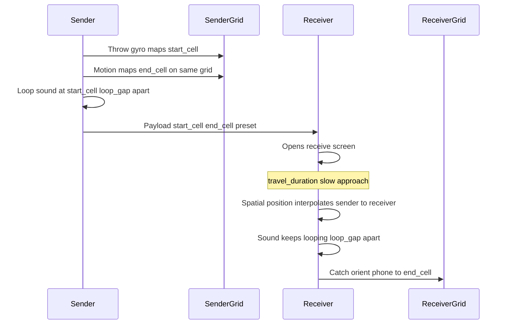

# Ponged V1: Core Mechanic Test

> **Northstar (frozen — do not edit):** [NORTHSTAR_PLAN.md](NORTHSTAR_PLAN.md)
>
> **V1 goal:** Prove the **core mechanic** feels good: sound **starts and ends on the sender’s 3×3 grid**, **loops** while it **slowly travels** (~50 ft over ~10 s) to the receiver, who **orients their phone** to catch it at the matching cell.

---

## Tunable parameters

**Edit this table to tune feel — implementation should read from a single config object (e.g. `MechanicConfig.ts`).**

| Key | Value | Unit | Description |
|-----|-------|------|-------------|
| `loop_gap` | **0.5** | seconds | Silence between each sound repeat while in flight / on grid |
| `travel_duration` | **10** | seconds | Time for sound to move from sender → receiver after receiver opens |
| `imaginary_distance` | **50** | feet | Fictionally how far apart the two phones are |
| `travel_speed` | **5** | ft/s | Derived: `imaginary_distance / travel_duration` |
| `grid_columns` | **3** | cells | Horizontal grid size |
| `grid_rows` | **3** | cells | Vertical grid size |
| `catch_hold_duration` | **0.3** | seconds | How long receiver must hold correct orientation to catch |
| `catch_angle_tolerance` | **15** | degrees | Gyro tolerance for “aligned” with target cell |
| `sender_preview_loops` | **3** | count | Optional loops on sender after throw (uses `loop_gap`) |
| `travel_curve` | **linear** | enum | `linear` \| `easeInOut` — spatial interpolation over travel |
| `min_receiver_open_delay` | **0** | seconds | Delay before travel starts after receive screen mounts |

*Derived at runtime:* `loops_during_travel ≈ floor(travel_duration / (sound_duration + loop_gap))` — depends on preset clip length.

---

## Core mechanic (V1 heart)

**No bounces.** Path is defined entirely on the **sender’s grid**: a **start cell** and **end cell**. The same preset **loops** with **`loop_gap`** between plays. When the **receiver opens**, the sound **moves slowly** from sender toward them over **`travel_duration`**, across imaginary **`imaginary_distance`**.



### The 3×3 grid

```
┌───┬───┬───┐
│0,2│1,2│2,2│  top
├───┼───┼───┤
│0,1│1,1│2,1│  mid
├───┼───┼───┤
│0,0│1,0│2,0│  bottom
└───┴───┴───┘
```

Cells: `(col, row)` — `col` 0→2 left to right, `row` 0→2 bottom to top.

| Role | Grid use |
|------|----------|
| **Sender** | **`start_cell`** and **`end_cell`** both live on the sender’s 3×3. Throw motion (gyro) sets start; path rules set end on **same grid**. |
| **Receiver** | Same 3×3 layout. **`end_cell`** uses the **same indices** as sender (shared coordinates). Receiver catches by aligning phone to that cell when sound arrives. |

There is **no bounce** between cells — only a single segment from `start_cell` → `end_cell` on the sender grid (visual line optional). Audio does not hop cell-to-cell; it **loops in place** on the sender, then **one continuous slow travel** to the receiver.

---

### Throw (sender)

1. Pick preset (`POW!`, `ZAP!`, `CRASH!`).
2. **Throw screen** — sender’s 3×3 grid.
3. Throw gesture → gyro → **`start_cell`**.
4. Same motion (or throw vector) → **`end_cell`** on **sender grid** (must differ from start; clamp to valid cell).
5. **Sender feedback:** play preset at `start_cell`; **loop** `sender_preview_loops` times with **`loop_gap`** between; optional highlight `start_cell` → `end_cell`.
6. Send payload: `{ start_cell, end_cell, preset, throw_vector }`.

**No bounce, no multi-hop path.**

**Input tiers**

| Tier | Input | Mapping |
|------|-------|---------|
| **V1a** | Tap start cell, tap end cell | Direct |
| **V1b** | Throw gesture + gyro | Quantize release attitude → start; vector → end |

---

### Travel (receiver — on open)

Triggered when receiver **opens** the receive screen (or after `min_receiver_open_delay`).

1. Show receiver’s 3×3; highlight **`end_cell`** (dim until arrival).
2. **Spatial audio travel** over **`travel_duration`** (10 s default):
   - Position interpolates from **sender side** (far, muted) → **receiver grid / end_cell** (near, full).
   - Use **`imaginary_distance`** (50 ft) to scale perceived speed: `travel_speed` = 5 ft/s.
   - **Same preset loops** throughout travel; **`loop_gap`** between each play.
   - Pan/gain/filters update **slowly** per frame — not instant jumps.
3. At **t = travel_duration**, sound is “at” **`end_cell`** — catch window opens.

**Interpolation:** map `t / travel_duration` → distance `d = t * travel_speed` capped at `imaginary_distance`; map `d` to stereo pan / HRTF-lite position from sender anchor to `end_cell` anchor.

---

### Catch (receiver)

1. After travel completes (or final loop lands), **`end_cell`** pulses.
2. Receiver **orients phone** (gyro) to aim at **`end_cell`** within **`catch_angle_tolerance`** for **`catch_hold_duration`**.
3. Success → **SUCCESSFUL HIT!** → return to pick sound.
4. **Debug fallback:** tap `end_cell` (log only; not primary).

---

### Path on sender grid (start → end, no bounce)

Single straight segment for UI only:

```
end_cell = neighbor_steps(start_cell, direction_from_gyro, step_count=1 or 2)
```

- `step_count` default **2** (corner to corner feel) or **1** (adjacent).
- Clamp inside grid; if start == end after clamp, nudge end to nearest different cell.

---

## Screens (V1)

| # | Screen | Notes |
|---|--------|-------|
| 1 | **Home** | Name; Play |
| 2 | **Pick sound** | 3 presets |
| 3 | **Throw** | Sender grid; start/end; preview loops |
| 4 | **Receive** | Travel 10 s + looping audio; gyro catch at end_cell |
| 5 | **Success** | Return loop |

**Pass-and-play:** handoff interstitial → receive with baked payload.

---

## Payload

```typescript
type GridCell = { col: 0 | 1 | 2; row: 0 | 1 | 2 };

type Ping = {
  presetKey: 'pow' | 'zap' | 'crash';
  startCell: GridCell;   // sender grid
  endCell: GridCell;     // sender grid (receiver uses same indices)
  throwVector?: { pitch: number; yaw: number; peakAccel: number };
  senderName: string;
  status: 'sent' | 'caught';
  round: number;
  // Config snapshot optional for A/B:
  config?: { loop_gap: number; travel_duration: number; imaginary_distance: number };
};
```

---

## Spatial audio (V1)

| Technique | V1 |
|-----------|-----|
| **9 cell pan table** | Fixed L/R (+ optional height) per `(col, row)` |
| **Looping** | Replay preset every `sound_duration + loop_gap` |
| **Travel** | Slow pan/gain interpolation over `travel_duration` |
| **Distance** | Attenuate by `d / imaginary_distance` during travel |
| **Bounces** | **None** |

**Platform:** Native iOS or Expo + native module if pan during 10 s travel feels stepped.

---

## In scope vs out of scope

### In V1

- 3×3 sender grid: `start_cell` + `end_cell`
- Looping sound (`loop_gap`)
- 10 s slow travel on receiver open (`travel_duration`, `imaginary_distance`)
- Gyro catch at `end_cell`
- Tunable config table (above)
- 3 presets, pass-and-play

### Out of V1

| Deferred |
|----------|
| Bounces between cells |
| Auth, friends, push |
| Record your own |
| Full storyboard UI |
| True binaural / AR |

---

## Validation

| Signal | Target |
|--------|--------|
| **Travel felt slow** | ≥3/5 comment on slow approach / building tension |
| **Loop noticed** | ≥3/5 notice repeating sound with gap |
| **Catch understood** | ≥4/5 move phone, not only tap |
| **Catch success** | ≥60% within 3 tries |
| **Unprompted return** | ≥50% round 2+ |
| **Smile test** | ≥4/5 on first catch |

**Kill:** 10 s feels boring → try `travel_duration` 6–7 s; if still flat, add visual comet before shortening audio.

---

## Build schedule (~2 weeks)

| Days | Deliverable |
|------|-------------|
| 1–2 | `MechanicConfig` from table; grid UI; 9-position pan; single loop |
| 3–4 | Sender start/end + preview loops |
| 5–7 | Receiver travel interpolator over `travel_duration`; looping during travel |
| 8–9 | Gyro catch + tolerance from config |
| 10–12 | Pass-and-play, paired tests, tune table values |

---

## Plan files

| File | Role |
|------|------|
| [NORTHSTAR_PLAN.md](NORTHSTAR_PLAN.md) | Frozen |
| **V1_PLAN.md** | Active — **tune the parameters table here** |

**Say “execute the plan” to scaffold the app.**
